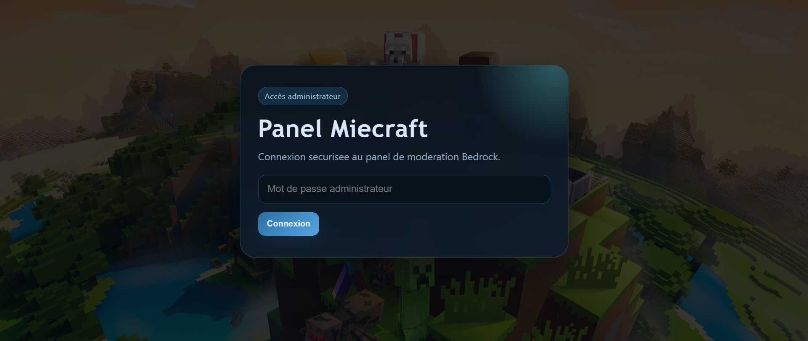
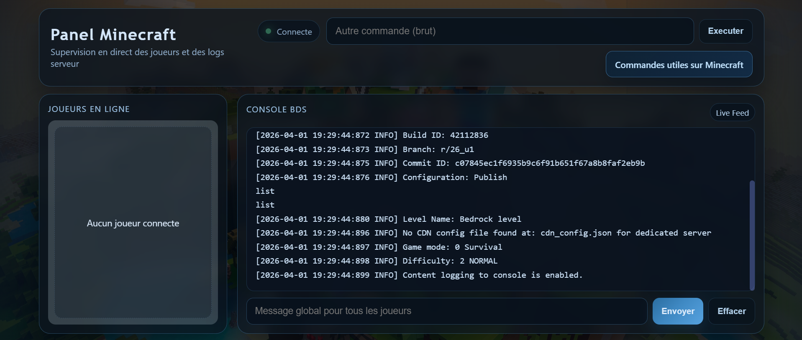

# Minecraft Bedrock Admin Panel

Panel web moderne pour administrer un serveur Minecraft Bedrock en direct.

Ce projet connecte une interface web à la console BDS via WebSocket et permet de:

- visualiser les logs en temps réel
- suivre les joueurs connectés
- envoyer des commandes
- bannir, expulser ou tuer un joueur depuis l'interface

---

## Aperçu

Le projet est composé de:

- un backend Node.js qui lance `bedrock_server.exe` avec `node-pty`
- un serveur HTTP qui sert l'interface web
- un serveur WebSocket pour l'authentification et les commandes en direct
- un frontend HTML/CSS/JS avec écran de connexion et console live

### Captures

#### Écran de connexion



#### Dashboard



---

## Fonctionnalités

- Authentification simple par mot de passe
- Console live (stream des logs BDS)
- Détection des connexions/déconnexions joueurs
- Liste des joueurs en ligne (rafraîchie automatiquement via `list` toutes les 60 secondes)
- Actions admin rapides sur chaque carte joueur: `Kick`, `Ban`, `Kill`
- Envoi de commandes brutes (console)
- Message global (`say`) depuis la barre de commande

---

## Prérequis

- Windows
- Node.js 18+
- Un serveur Minecraft Bedrock fonctionnel (`bedrock_server.exe`)

---

## Installation

1. Cloner le dépôt:

```bash
git clone https://github.com/TheVaro93/Pannel_du_seigneur_Gras.git
cd Pannel_du_seigneur_Gras
```

2. Installer les dépendances:

```bash
npm ci
```

3. Configurer les variables d'environnement:

- Copier `.env.example` vers `.env`
- Renseigner `PORT`, `PANEL_PASSWORD`, `BDS_PATH`

Exemple `.env`:

```env
PORT=3000
PANEL_PASSWORD=change-moi
BDS_PATH=C:\\Serveur_Minecraft\\Minecraft-Server\\bedrock_server.exe
```

---

## Lancer le projet

Option A (recommandée)

```bash
npm run start
```

Puis ouvrir:

- `http://localhost:3000`

Option B

- Lancer `start.bat` pour:
	- démarrer `playit.exe` (si présent dans `C:\Serveur_Minecraft\playit_gg\bin\playit.exe`)
	- démarrer le serveur Node
	- ouvrir automatiquement le navigateur sur `http://localhost:3000`

---

## Utilisation

1. Ouvrir le panel dans le navigateur.
2. Entrer le mot de passe admin.
3. Surveiller les logs et les joueurs en ligne.
4. Utiliser:
- la barre principale pour envoyer un message global (`say`)
- la commande brute pour exécuter n'importe quelle commande Bedrock
- les boutons d'action `Kick` / `Ban` / `Kill` directement sur chaque joueur dans la liste

---

## Structure du projet

```text
.
|- index.html      # Interface web
|- style.css       # Styles
|- login.js        # Logique frontend utilisée par index.html
|- script.js       # Ancienne version (non chargée par index.html)
|- server.js       # Backend HTTP + WebSocket + lancement BDS
|- start.bat       # Script de démarrage Windows
|- package.json
|- LICENSE
|- README.md
```

---

## Sécurité

Le backend peut lire la configuration depuis `.env`, mais il garde aussi des valeurs par défaut si les variables ne sont pas définies.

Déjà appliqué dans ce projet:

- mot de passe admin via variable d'environnement (`PANEL_PASSWORD`)
- chemin BDS via variable d'environnement (`BDS_PATH`)
- `.env` ignoré par Git

Important:

- en absence de `.env`, des valeurs par défaut sont utilisées (dont un mot de passe par défaut) ; pour la prod, définis toujours tes variables d'environnement.

À mettre en place selon ton infra:

- HTTPS + WSS
- limitation d'accès au panel via firewall/VPN
- journalisation des actions admin

---

## Dépannage rapide

- Erreur `BDS introuvable`:
	vérifier la variable `BDS_PATH` dans `.env`.
- Échec de connexion:
	vérifier que `npm run start` tourne bien et que le port n'est pas bloqué.
- Pas de logs dans la console:
	vérifier que BDS démarre correctement et que `bedrock_server.exe` est exécutable.

---

## Roadmap (idées)

- gestion des whitelist/permissions
- historique des commandes admin
- mode multi-serveurs
- stats en temps réel (TPS, joueurs, uptime)

---

## Licence

Ce projet est sous licence MIT.
Voir [LICENSE](LICENSE).
